# Лабораторная работа №6
## Тема:
 Использование шаблонов проектирования
## Цель работы:
 Получить опыт применения шаблонов проектирования при написании кода программной системы.


# Шаблоны проектирования GoF

GoF (Gang of Four) — так называют паттерны проектирования («шаблоны проектирования»). Это набор из 23 классических паттернов, описанных в книге «Design Patterns: Elements of Reusable Object-Oriented Software».

Паттерны служат шаблонами для решения распространённых проблем проектирования программного обеспечения и помогают разработчикам создавать гибкие и легко расширяемые системы. 

---

# Порождающие шаблоны

## 1. Singleton

### Что это

Singleton гарантирует существование единственного экземпляра класса в системе и предоставляет глобальную точку доступа к нему.

### Как используется в проекте

В Spring Boot все сервисы являются Singleton-бинами по умолчанию. Например, `UserService` существует в единственном экземпляре и используется всеми контроллерами.

### Диаграмма

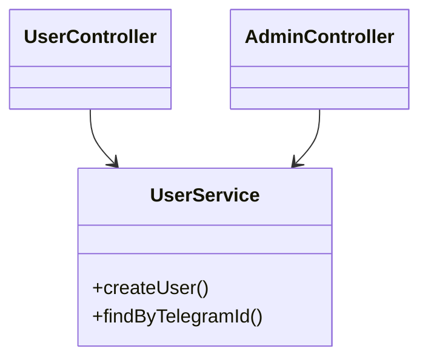

### Код

```java
@Service
public class UserService {

    private final UserRepository repository;

    public UserService(UserRepository repository) {
        this.repository = repository;
    }

    public User createUser(User user) {
        return repository.save(user);
    }
}
```

Spring создаёт единственный экземпляр `UserService`.

### Результат

Обеспечивается централизованное управление бизнес-логикой и отсутствие дублирования состояния.

---

## 2. Factory Method

### Что это

Factory Method определяет интерфейс создания объекта, позволяя подклассам решать, какой класс создавать.

### Как используется

Создание различных типов QR-кодов (регистрация, администрирование, вход).

### Диаграмма

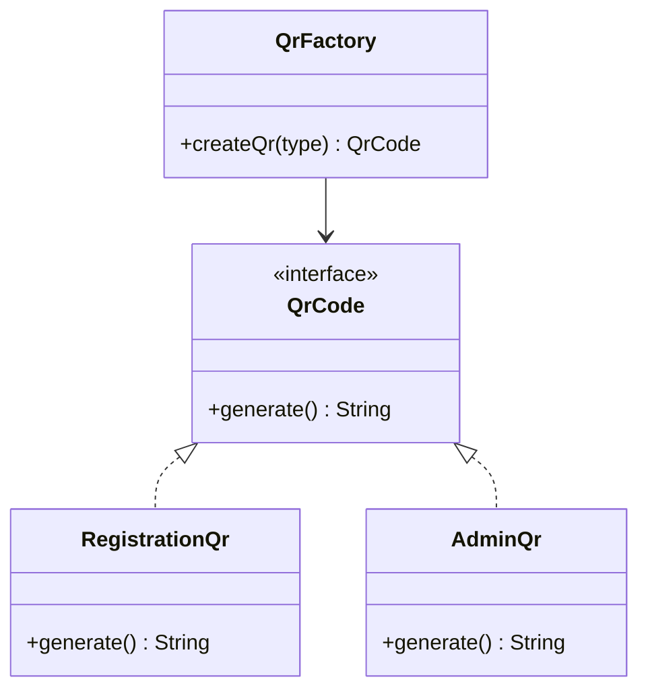

### Код

```java
public interface QrCode {
    String generate();
}

public class RegistrationQr implements QrCode {
    public String generate() {
        return "REG-" + UUID.randomUUID();
    }
}

public class AdminQr implements QrCode {
    public String generate() {
        return "ADMIN-" + UUID.randomUUID();
    }
}

@Component
public class QrFactory {

    public QrCode createQr(String type) {
        if ("REG".equals(type)) {
            return new RegistrationQr();
        }
        return new AdminQr();
    }
}
```

### Результат

Упрощается расширение системы новыми типами QR без изменения клиентского кода.

---

## 3. Builder

### Что это

Builder позволяет пошагово создавать сложный объект.

### Как используется

Создание сущности `User` с несколькими параметрами.

### Диаграмма

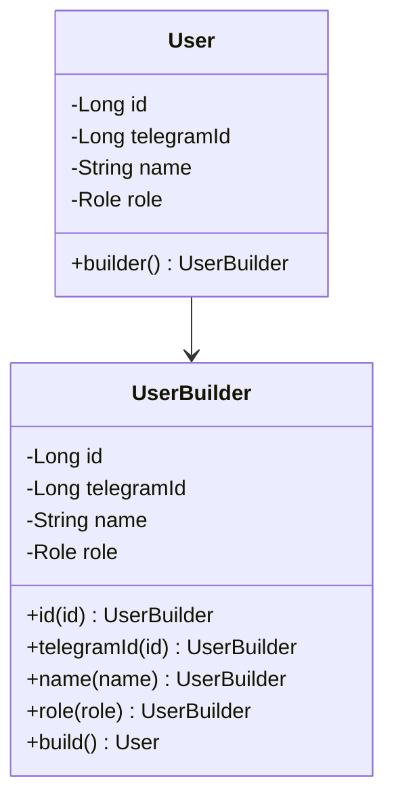

### Код

```java
@Entity
@Builder
@Getter
@NoArgsConstructor
@AllArgsConstructor
public class User {

    @Id
    @GeneratedValue
    private Long id;

    private Long telegramId;
    private String name;

    @Enumerated(EnumType.STRING)
    private Role role;
}
```

### Результат

Повышается читаемость кода и снижается вероятность ошибок при создании объектов.

---

# Структурные шаблоны

## 4. Adapter

### Что это

Adapter преобразует интерфейс одного класса в интерфейс, ожидаемый клиентом.

### Применение

Telegram Update адаптируется к внутреннему сервисному интерфейсу.

### Диаграмма

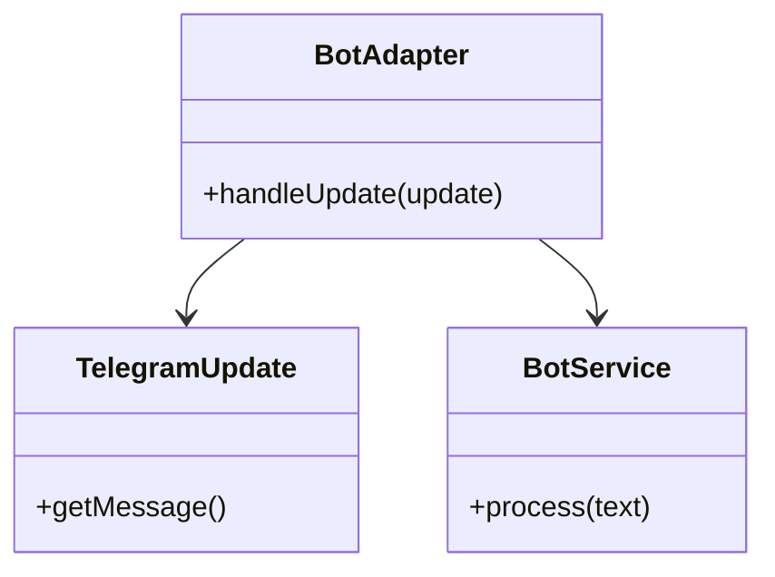

### Код

```java
@Component
public class BotAdapter {

    private final BotService botService;

    public BotAdapter(BotService botService) {
        this.botService = botService;
    }

    public void handleUpdate(TelegramUpdate update) {
        botService.process(update.getMessage().getText());
    }
}
```

### Результат

Изоляция бизнес-логики от внешнего API.

---

## 5. Facade

### Что это

Facade предоставляет единый упрощённый интерфейс к подсистеме.

### Применение

QrFacade объединяет генерацию и сохранение QR.

### Диаграмма

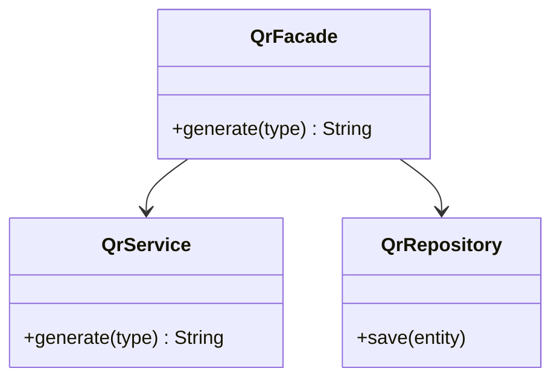

### Код

```java
@Component
public class QrFacade {

    private final QrService qrService;
    private final QrRepository qrRepository;

    public QrFacade(QrService qrService, QrRepository qrRepository) {
        this.qrService = qrService;
        this.qrRepository = qrRepository;
    }

    public String generate(String type) {
        String code = qrService.generate(type);
        qrRepository.save(new QrEntity(code));
        return code;
    }
}
```

### Результат

Уменьшается связность контроллера с внутренними компонентами.

---

## 6. Proxy

### Что это

Proxy контролирует доступ к объекту.

### Применение

Проверка роли пользователя перед выполнением операции.

### Диаграмма

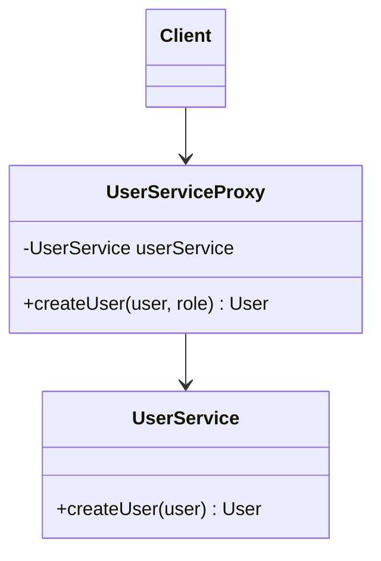

### Код

```java
@Component
public class UserServiceProxy {

    private final UserService userService;

    public UserServiceProxy(UserService userService) {
        this.userService = userService;
    }

    public User createUser(User user, Role role) {
        if (role != Role.ADMIN) {
            throw new RuntimeException("Access denied");
        }
        return userService.createUser(user);
    }
}
```

### Результат

Добавляется контроль доступа без изменения основного класса.

---

## 7. Decorator

### Что это

Decorator добавляет поведение объекту динамически.

### Применение

Логирование вызовов сервисов.

### Диаграмма

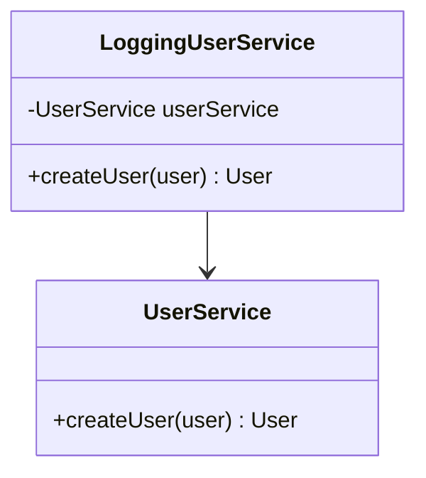

### Код

```java
@Component
public class LoggingUserService {

    private final UserService userService;

    public LoggingUserService(UserService userService) {
        this.userService = userService;
    }

    public User createUser(User user) {
        System.out.println("Creating user: " + user.getName());
        return userService.createUser(user);
    }
}
```

### Результат

Добавляется дополнительная функциональность без изменения бизнес-логики.

---

# Поведенческие шаблон

## 8. Strategy

### Что это

Strategy позволяет выбирать алгоритм во время выполнения. Вместо жёсткой if/else логики поведение инкапсулируется в отдельные классы.

### Где используется в проекте

В backend Telegram-бота для конференции QR-код может обрабатываться по-разному: регистрация участника, валидация входа, отметка посещения доклада.

### Диаграмма

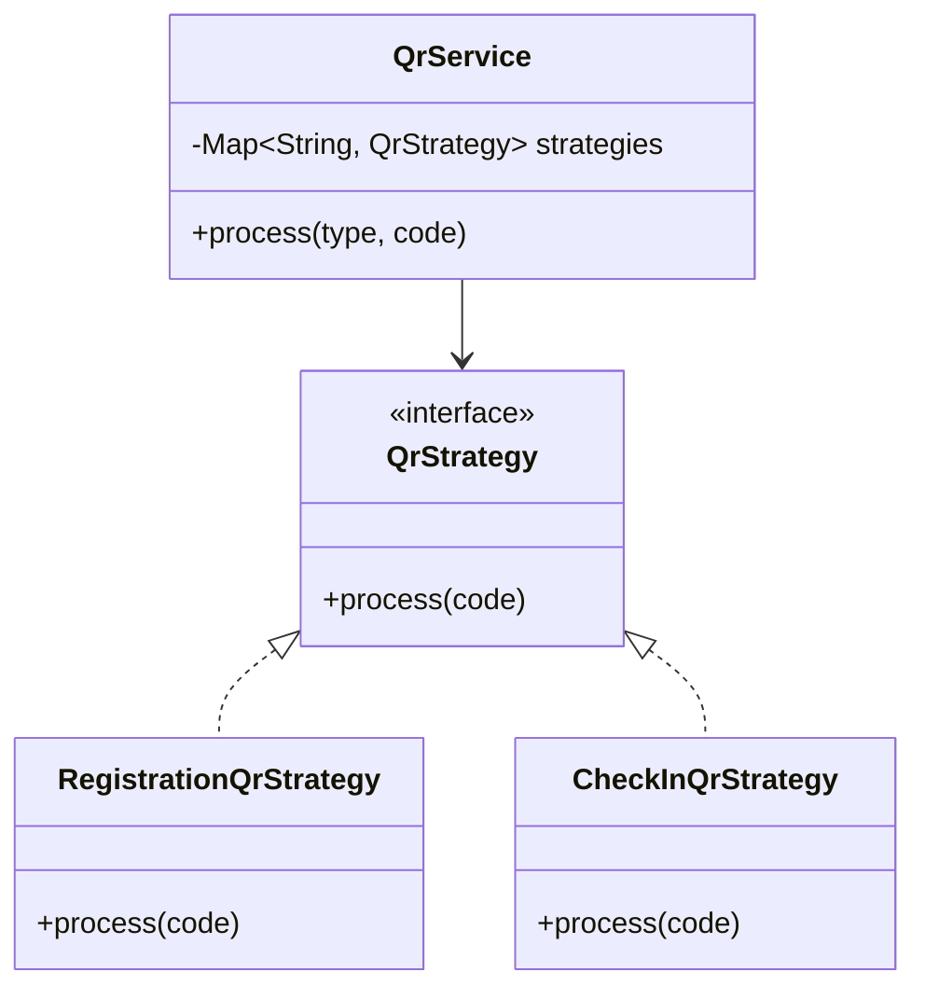

### Код

```java
public interface QrStrategy {
    void process(String code);
}
```

```java
@Service
public class RegistrationQrStrategy implements QrStrategy {

    private final UserService userService;

    public RegistrationQrStrategy(UserService userService) {
        this.userService = userService;
    }

    @Override
    public void process(String code) {
        userService.registerUserByQr(code);
    }
}
```

```java
@Service
public class QrService {

    private final Map<String, QrStrategy> strategies;

    public QrService(List<QrStrategy> strategyList) {
        this.strategies = strategyList.stream()
            .collect(Collectors.toMap(
                s -> s.getClass().getSimpleName(),
                s -> s
            ));
    }

    public void process(String type, String code) {
        QrStrategy strategy = strategies.get(type);
        strategy.process(code);
    }
}
```

### Результат

- Убрана жёсткая логика ветвлений
- Добавление нового типа QR не требует изменения QrService
- Поведение легко расширяется

---

## 9. Command

### Что это

Command инкапсулирует запрос как объект.

### Где используется

Каждая команда Telegram-бота (`/start`, `/register`, `/profile`) реализуется отдельным классом.

### Диаграмма

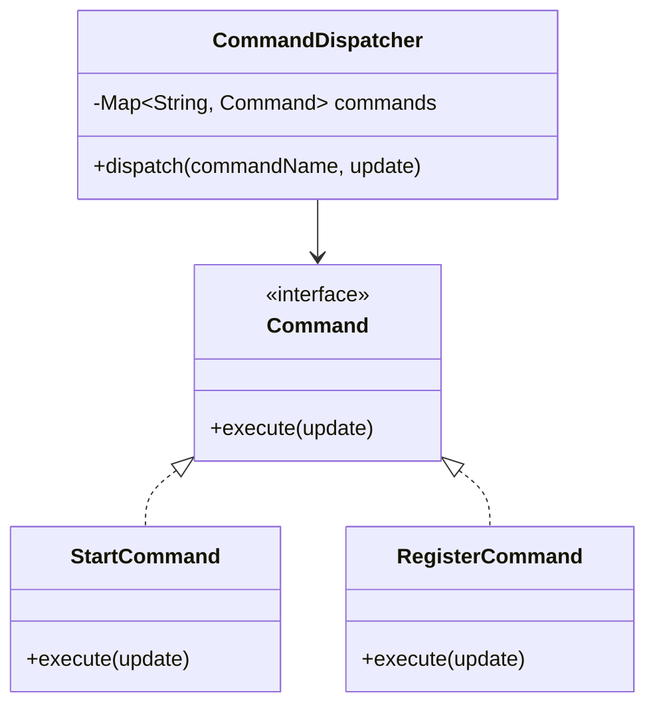

### Код

```java
public interface Command {
    void execute(Update update);
}
```

```java
@Component
public class RegisterCommand implements Command {

    private final UserService userService;

    public RegisterCommand(UserService userService) {
        this.userService = userService;
    }

    @Override
    public void execute(Update update) {
        String telegramId = update.getMessage().getFrom().getId().toString();
        userService.register(telegramId);
    }
}
```

```java
@Component
public class CommandDispatcher {

    private final Map<String, Command> commands;

    public CommandDispatcher(List<Command> commandList) {
        this.commands = commandList.stream()
            .collect(Collectors.toMap(
                c -> c.getClass().getSimpleName(),
                c -> c
            ));
    }

    public void dispatch(String commandName, Update update) {
        commands.get(commandName).execute(update);
    }
}
```

### Результат

- Упрощено добавление новых команд
- Код стал расширяемым
- Логика команд изолирована

---

## 10. Observer

### Что это

Observer реализует механизм подписки на события.

### Где используется

После регистрации пользователя: создаётся QR, отправляется сообщение, логируется событие.

### Диаграмма

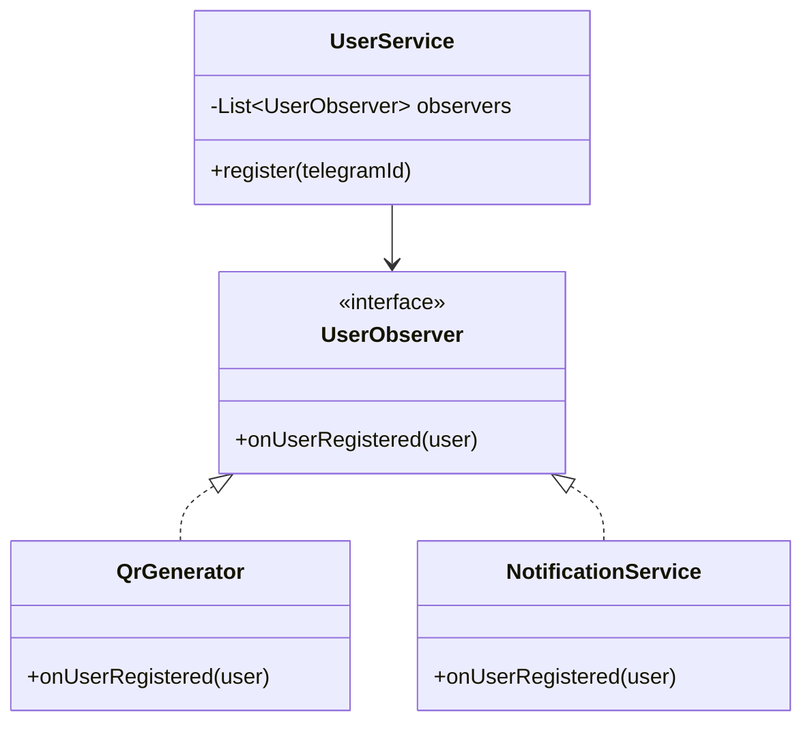

### Код

```java
public interface UserObserver {
    void onUserRegistered(User user);
}
```

```java
@Service
public class UserService {

    private final List<UserObserver> observers;

    public UserService(List<UserObserver> observers) {
        this.observers = observers;
    }

    public void register(String telegramId) {
        User user = new User(telegramId);
        // сохранение в БД

        observers.forEach(o -> o.onUserRegistered(user));
    }
}
```

```java
@Component
public class QrGenerator implements UserObserver {

    @Override
    public void onUserRegistered(User user) {
        // генерация QR
    }
}
```

### Результат

- Ослаблена связность
- Можно добавлять новые реакции на событие
- UserService не зависит от конкретных реализаций

## 11. Iterator

### Что это

Iterator предоставляет способ последовательного доступа ко всем элементам составного объекта без раскрытия его внутреннего представления.

### Где используется в проекте

В боте для конференции необходимо обходить список участников, зарегистрированных на конкретный доклад, чтобы отправить им уведомления.

### Диаграмма

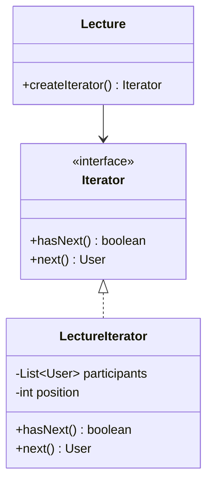

### Код

```java
public interface Iterator {
    boolean hasNext();
    User next();
}
```

```java
public class LectureIterator implements Iterator {
    private List<User> participants;
    private int position = 0;
    
    public LectureIterator(Lecture lecture) {
        this.participants = lecture.getParticipants();
    }
    
    @Override
    public boolean hasNext() {
        return position < participants.size();
    }
    
    @Override
    public User next() {
        return participants.get(position++);
    }
}
```

```java
@Entity
public class Lecture {
    @ManyToMany
    private List<User> participants;
    
    public Iterator createIterator() {
        return new LectureIterator(this);
    }
}
```

```java
@Service
public class NotificationService {
    public void notifyAll(Lecture lecture, String message) {
        Iterator iterator = lecture.createIterator();
        while (iterator.hasNext()) {
            User user = iterator.next();
            sendMessage(user.getTelegramId(), message);
        }
    }
}
```

### Результат

- Клиентский код не зависит от того, как хранятся участники
- Единый способ обхода разных структур данных

---

## 12. Template Method

### Что это

Template Method определяет скелет алгоритма, оставляя реализацию некоторых шагов подклассам.

### Где используется в проекте

Отправка разных типов уведомлений: приветствие, подтверждение регистрации, напоминание.

### Диаграмма

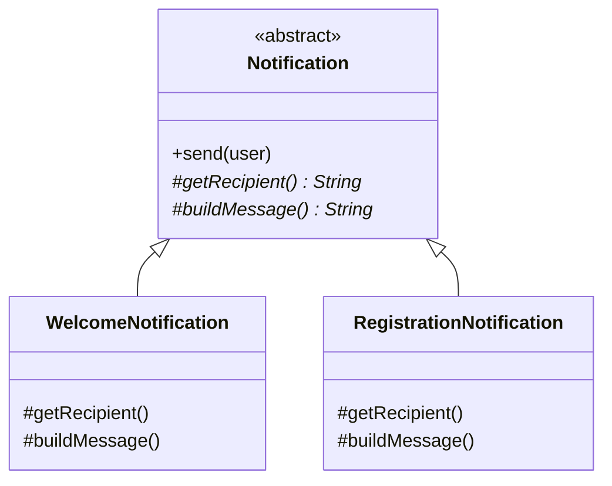

### Код

```java
public abstract class Notification {
    
    public final void send(User user) {
        String to = getRecipient(user);
        String text = buildMessage(user);
        telegramService.send(to, text);
    }
    
    protected abstract String getRecipient(User user);
    protected abstract String buildMessage(User user);
}
```

```java
@Component
public class WelcomeNotification extends Notification {
    
    @Override
    protected String getRecipient(User user) {
        return user.getTelegramId().toString();
    }
    
    @Override
    protected String buildMessage(User user) {
        return "Добро пожаловать, " + user.getName() + "!";
    }
}
```

```java
@Component
public class RegistrationNotification extends Notification {
    
    @Override
    protected String getRecipient(User user) {
        return user.getTelegramId().toString();
    }
    
    @Override
    protected String buildMessage(User user) {
        return "Регистрация подтверждена! Ваш QR: " + user.getQrCode();
    }
}
```

```java
@Service
public class NotificationService {
    private final WelcomeNotification welcome;
    private final RegistrationNotification registration;
    
    public void sendWelcome(User user) {
        welcome.send(user);
    }
    
    public void sendRegistrationConfirm(User user) {
        registration.send(user);
    }
}
```

### Результат

- Общая структура алгоритма в одном месте
- Лёгкое добавление новых типов уведомлений

# Шаблоны проектирования GRASP

Метод GRASP (General Responsibility Assignment Software Patterns) определяет правила распределения ответственности между классами. В отличие от GoF, он не описывает структуру объектов, а отвечает на вопрос: «Кому поручить эту обязанность?».

В проекте GRASP может пригодиться для корректного распределения логики между контроллерами, сервисами, сущностями и репозиториями.

---

# Роли (обязанности) классов

## 1. Information Expert (Информационный эксперт)

Проблема:
Где должна находиться логика, если она опирается на данные конкретного объекта?

Решение:
Ответственность передаётся классу, который обладает всей необходимой информацией.

Применение в проекте:
Логика проверки статуса регистрации пользователя размещена в сущности User, а не в сервисе.

Код:

```java
@Entity
public class User {

    @Id
    private Long id;

    private boolean registered;

    public boolean canCheckIn() {
        return registered;
    }

    public void register() {
        this.registered = true;
    }
}
```

Результат:
Логика инкапсулирована внутри модели. Сервис не содержит бизнес-правил проверки.

Связь:
Связан с High Cohesion и принципом инкапсуляции.

---

## 2. Creator (Создатель)

Проблема:
Кто должен создавать объект?

Решение:
Объект создаёт класс, который его использует, агрегирует или содержит.

Применение:
UserService создаёт объект User, потому что он управляет жизненным циклом пользователя.

Код:

```java
@Service
public class UserService {

    private final UserRepository userRepository;

    public User register(String telegramId) {
        User user = new User();
        user.setTelegramId(telegramId);
        user.register();

        return userRepository.save(user);
    }
}
```

Результат:
Создание объекта сосредоточено в сервисе, контроллер не знает деталей создания.

Связь:
Связан с Factory Method (GoF) и Low Coupling.

---

## 3. Controller (Контроллер)

Проблема:
Кто принимает системные события от внешнего мира?

Решение:
Создаётся класс-контроллер, который принимает запрос и делегирует выполнение.

Применение:
BotController принимает входящее сообщение Telegram и передаёт его сервисному слою.

Код:

```java
@RestController
@RequestMapping("/bot")
public class BotController {

    private final CommandDispatcher dispatcher;

    @PostMapping
    public void handleUpdate(@RequestBody Update update) {
        dispatcher.dispatch(update.getMessage().getText(), update);
    }
}
```

Результат:
Контроллер не содержит бизнес-логики, только координацию.

Связь:
Связан с GoF Command и Strategy.

---

## 4. Low Coupling (Низкая связность)

Проблема:
Сильная зависимость между классами усложняет изменение кода.

Решение:
Классы взаимодействуют через интерфейсы.

Применение:
UserService зависит от интерфейса UserRepository.

Код:

```java
public interface UserRepository extends JpaRepository<User, Long> {
    Optional<User> findByTelegramId(String telegramId);
}
```

```java
@Service
public class UserService {

    private final UserRepository userRepository;

    public UserService(UserRepository userRepository) {
        this.userRepository = userRepository;
    }
}
```

Результат:
Можно заменить реализацию репозитория без изменения сервиса.

Связь:
Связан с Dependency Injection и DIP.

---

## 5. High Cohesion (Высокая связность)

Проблема:
Класс выполняет слишком много разных задач.

Решение:
Каждый класс отвечает за одну логическую обязанность.

Применение:
QrService отвечает только за обработку QR, UserService — только за пользователей.

Код:

```java
@Service
public class QrService {

    private final QrStrategy strategy;

    public void process(String code) {
        strategy.process(code);
    }
}
```

Результат:
Логика разделена по областям ответственности.

Связь:
Связан с Single Responsibility Principle и Strategy.

---

# Принципы разработки

## 1. Indirection (Промежуточный уровень)

Проблема:
Прямое взаимодействие компонентов увеличивает зависимость.

Решение:
Вводится промежуточный объект.

Применение:
CommandDispatcher выступает посредником между контроллером и командами.

Код:

```java
@Component
public class CommandDispatcher {

    private final Map<String, Command> commands;

    public void dispatch(String name, Update update) {
        commands.get(name).execute(update);
    }
}
```

Результат:
Контроллер не знает конкретные команды.

Связь:
Связан с Mediator и Command.

---

## 2. Polymorphism (Полиморфизм)

Проблема:
Условные конструкции усложняют код.

Решение:
Использовать интерфейсы и полиморфные вызовы.

Применение:
QrStrategy реализует разные алгоритмы обработки.

Код:

```java
public interface QrStrategy {
    void process(String code);
}
```

Результат:
Добавление нового типа QR не требует изменения существующего кода.

Связь:
Связан с Strategy.

---

## 3. Protected Variations (Защищённые изменения)

Проблема:
Изменение одного модуля ломает другие.

Решение:
Изменяемые элементы скрываются за стабильными интерфейсами.

Применение:
Repository скрывает детали работы с PostgreSQL.

Код:

```java
public interface UserRepository {
    User save(User user);
}
```

Результат:
Можно заменить PostgreSQL на другую БД без изменения бизнес-логики.

Связь:
Связан с Adapter и Dependency Inversion.

---

# Свойство программы

## Maintainability (Поддерживаемость)

Проблема:
Рост проекта усложняет его изменение и расширение.

Решение:
Использование GRASP приводит к разделению обязанностей, слабой связности и высокой когезии.

Пример:
Добавление новой команды Telegram:

```java
@Component
public class ProfileCommand implements Command {

    private final UserService userService;

    @Override
    public void execute(Update update) {
        userService.getProfile(update.getMessage().getFrom().getId());
    }
}
```

Контроллер и другие классы не изменяются.

Результат:
Проект масштабируется без переработки существующего кода.

Связь:
Достигается за счёт Low Coupling, High Cohesion, Polymorphism и Indirection.
